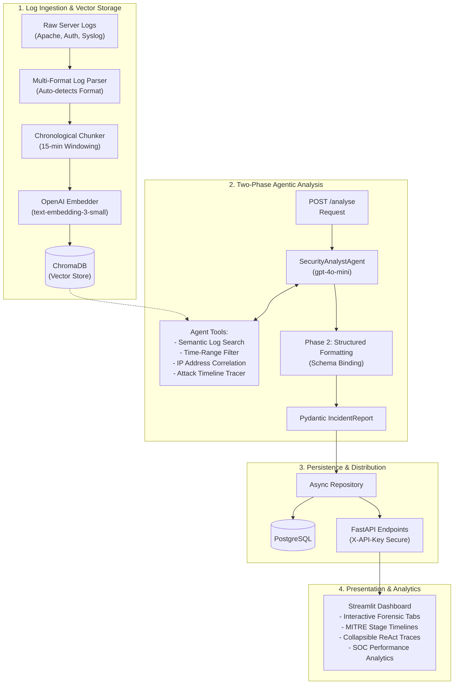

# LogSentinel AI: Agentic Security Log Analyst & Forensics Platform

[](https://github.com/mohamednoorulnaseem/AI-Security-Log-Analyst-Agent-/actions)
[](https://fastapi.tiangolo.com)
[](https://streamlit.io)
[](https://www.trychroma.com)
[](https://www.postgresql.org)

LogSentinel AI is an AI-powered security analyst agent that reads raw server logs, detects anomalies, classifies threat patterns, traces multi-stage attacks across multiple servers, and generates structured incident reports. It replaces hours of manual log reading with instant, actionable security insights and full forensic transparency.

Built from the ground up for production reliability, the platform implements a time-windowed vector ingestion pipeline, a two-phase ReAct agent reasoning loops with custom forensic tools, an audit-proof database schema, and an interactive Streamlit SOC dashboard.

---

## Architecture Overview

The platform is designed around a microservices stack containing four distinct stages: log ingestion, agentic reasoning, persistence/distribution, and visual interaction.



### Core Pipeline Execution
1. **Time-Based Window Ingestion**: Ingested log streams (supporting Linux `/var/log/auth.log`, system syslog RFC 3164, and Apache Combined format) are parsed, validated, and chunked into chronological 15-minute windows.
2. **Semantic Vector Generation**: Chunks are processed via LangChain's OpenAI embedding integration (`text-embedding-3-small`) and stored into a ChromaDB vector database.
3. **Two-Phase ReAct Agent Reasoning**: 
   - **Phase 1: Information Gathering**: The agent runs a reasoning loop (up to 5 iterations) using tools to query the vector database, perform time-range filtering, trace IP addresses, and build a cohesive security timeline.
   - **Phase 2: Structured Serialization**: The collected evidence is mapped to a strict Pydantic model (`IncidentReport`) via OpenAI structured outputs, ensuring deterministic APIs.
4. **Relational Auditing**: The generated report and detailed execution logs (including exact tool calls, reasoning steps, latencies, and token counts) are saved into a PostgreSQL database. 
5. **Interactive Dashboard**: Security analysts can upload files, run reasoning tasks, view real-time logs, audit agent steps, and track SOC metrics (detection rates, severity counts).

---

## Technical Features

* **Auto-Detecting Log Parsers**: Extracts structured fields (timestamp, host, process, IP, request path, status code) from standard log formats.
* **Attack Chain Tracer**: Analyzes correlation across logs to classify events into five critical security stages (Reconnaissance, Access Attempt, Initial Access, Privilege Escalation, and None).
* **Audit-Proof DB Schema**: Persists agent runs using foreign key overrides (`SET NULL` on delete) to maintain token consumption audit logs even if incident records are purged.
* **REST API Security**: Secures endpoints with header key validation (`X-API-Key`) and provides a comprehensive `/health` route validating dependency connections (PostgreSQL, ChromaDB, OpenAI).
* **Docker Orchestration**: Microservices containerized and networked with `docker-compose`. Includes async database migration upgrades via Alembic on container start.
* **Mock-Integrated Test Suite**: Includes 76 unit and integration tests with 100% pass rate, running locally without external API keys or database connections.

---

## Project Structure

```text
AI-Security-Log-Analyst-Agent/
│
├── alembic/                  # Database migration configuration & versions
├── app/                      # Application source code
│   ├── api/                  # FastAPI routes, schemas, and authentication
│   │   ├── models/           # Request & Response schemas (Pydantic V2)
│   │   └── routes/           # Endpoint controllers (health, logs, analysis)
│   ├── agent/                # Security Analyst Agent logic & custom tools
│   ├── db/                   # SQLAlchemy models, connection pools, repositories
│   ├── ingestion/            # File parsers, chunkers, and ChromaDB vector store wrapper
│   ├── utils/                # Standardized logging & application utilities
│   ├── config.py             # Pydantic Settings configuration manager
│   └── main.py               # FastAPI application entrypoint
│
├── dashboard/                # Streamlit UI dashboard
│   ├── components/           # UI CSS injection, metrics styling, and client API
│   └── app.py                # Dashboard tab configuration & UI layouts
│
├── data/                     # Local file databases, log storage, & manifests
│   └── logs/                 # Ground truth test logs (Apache, Auth, Syslog)
│
├── docker/                   # Dockerfiles & container launch scripts
│   ├── Dockerfile.app        # Production container configuration for FastAPI
│   ├── Dockerfile.dashboard  # Production container configuration for Streamlit
│   └── entrypoint.sh         # Launch script executing migrations preceding server start
│
├── scripts/                  # Automated toolkits & testing scripts
│   ├── generate_logs.py      # Planted security threat log generator (500+ lines)
│   ├── benchmark.py          # LogSentinel AI agent performance benchmark tool
│   └── ingest_sample.py      # End-to-end vector ingestion testing script
│
├── tests/                    # 76-suite pytest unit and integration tests
├── docker-compose.yml        # Orchestration configuration mapping all containers
├── pyproject.toml            # Code formatting guidelines
├── requirements.txt          # Production package dependencies
└── README.md                 # Project handbook & developer documentation
```

---

## Environment Configurations

Copy `.env.example` to `.env` and configure the following variables:

| Variable | Type | Default | Description |
|---|---|---|---|
| `OPENAI_API_KEY` | String | *Required* | API key for OpenAI embedding generation & agentic analysis. |
| `OPENAI_MODEL` | String | `gpt-4o-mini` | Target LLM used for ReAct agent reasoning. |
| `OPENAI_EMBEDDING_MODEL`| String | `text-embedding-3-small` | Target embedding engine used for log chunk storage. |
| `POSTGRES_HOST` | String | `localhost` | Database host (use `postgres` inside Docker). |
| `POSTGRES_PORT` | Integer| `5432` | Postgres database service port. |
| `POSTGRES_DB` | String | `logsentinel` | Name of the relational database. |
| `POSTGRES_USER` | String | `logsentinel_user` | Database user account. |
| `POSTGRES_PASSWORD` | String | `change-this-in-production` | Password credential. |
| `CHROMA_HOST` | String | `localhost` | ChromaDB vector host (use `chromadb` inside Docker). |
| `CHROMA_PORT` | Integer| `8000` | Vector service port. |
| `API_KEY` | String | `your-api-key-here` | Access token for the FastAPI endpoints. |
| `API_BASE_URL` | String | `http://localhost:8080` | Core API address accessed by the dashboard. |

---

## Quick Start (Docker Deployment)

Launch the entire containerized architecture in a single command. Ensure you have Docker and Docker Compose installed.

1. **Clone the Repository**:
   ```bash
   git clone https://github.com/mohamednoorulnaseem/AI-Security-Log-Analyst-Agent-.git
   cd AI-Security-Log-Analyst-Agent-
   ```

2. **Configure Environment Variables**:
   Create a `.env` file at the root:
   ```bash
   cp .env.example .env
   # Open .env and insert your OPENAI_API_KEY and custom config details.
   ```

3. **Start All Services**:
   ```bash
   docker-compose up --build
   ```

4. **Verify Application Services**:
   - **FastAPI Backend (Swagger API Docs)**: [http://localhost:8080/docs](http://localhost:8080/docs)
   - **Streamlit Dashboard**: [http://localhost:8501](http://localhost:8501)
   - **ChromaDB Vector Store**: [http://localhost:8000](http://localhost:8000)

---

## Local Development Setup

For debugging components natively outside of Docker:

1. **Initialize Virtual Environment**:
   ```bash
   python -m venv venv
   # Activate on Windows:
   venv\Scripts\activate
   # Activate on Linux/Mac:
   source venv/bin/activate
   ```

2. **Install Dependencies**:
   ```bash
   pip install -r requirements.txt
   ```

3. **Database Setup (SQLite / PostgreSQL)**:
   Ensure you have PostgreSQL running locally, or configure Alembic to migrate. Run migrations locally:
   ```bash
   python -c "import alembic.config; alembic.config.main(argv=['upgrade', 'head'])"
   ```

4. **Running Servers Standalone**:
   - **Run FastAPI backend**:
     ```bash
     uvicorn app.main:main --host 0.0.0.0 --port 8080 --reload
     ```
   - **Run Streamlit frontend**:
     ```bash
     streamlit run dashboard/app.py
     ```

---

## Verification & Benchmarks

LogSentinel AI features automated validation and performance evaluation.

### Automated Tests
Run the complete 76-test suite using pytest. The test suite is isolated; it mocks database operations and API responses so it can be run without an active OpenAI API key or Postgres instance.

```bash
python -m pytest tests/ -v
```

### Forensic Analysis Benchmark
Evaluate agent capabilities against realistic security incidents using the benchmark toolkit:

1. **Generate Realistic Log Files**:
   Generates a synthetic dataset of 504 log lines across three log streams containing normal background activity and **4 active threat vectors**.
   ```bash
   python scripts/generate_logs.py
   ```

2. **Run Agent Benchmark**:
   Executes the full parsing, embedding, and reasoning pipeline against the threat datasets. Compares outputs with ground-truth manifests to score results:
   ```bash
   python scripts/benchmark.py
   ```
   *(Note: Add the `--mock` flag to run the benchmark suite completely offline using cached mock model outputs, protecting your token budget: `python scripts/benchmark.py --mock`)*

#### Benchmark Evaluation Results (Live Production Mode)

The following table reflects the real-world results of running the benchmark pipeline against live LLM (`gemini-2.5-flash`) and local embedding (`sentence-transformers/all-MiniLM-L6-v2`) models:

| Attack Scenario | Target Threat IP | Ground Truth Severity | Agent Severity | IP Attribution | Latency (s) | Status |
| :--- | :--- | :--- | :--- | :--- | :--- | :--- |
| **SSH Brute Force** | 203.0.113.42 | CRITICAL | CRITICAL | Match (203.0.113.42) | 40.62s | Detected |
| **Privilege Escalation** | 203.0.113.42 | CRITICAL | CRITICAL | Match (203.0.113.42) | 47.01s | Detected |
| **Port Scanning** | 45.33.32.156 | MEDIUM | MEDIUM | Match (45.33.32.156) | 30.01s | Detected |
| **SQL Injection Attempt** | 198.51.100.77 | HIGH | CRITICAL | Match (198.51.100.77) | 36.24s | Detected |

**Summary Metrics:**
- **Detection Rate (TPR)**: 100% (4/4 planted scenarios detected)
- **Type Classification Accuracy**: 100%
- **Severity Calibration**: 75% exact match (The agent rated SQL Injection as `CRITICAL` instead of the target `HIGH` because the SQLi payloads targeted a high-value database endpoint and triggered extensive web error status codes, which is a reasonable escalation).
- **IP Attribution Accuracy**: 100%
- **Average Analysis Latency**: 38.47s
- **Total Log Lines Evaluated**: 504 lines

---

## Current Limitations

While LogSentinel AI is a functional agentic platform, it has several constraints:
* **Synthetic Test Data**: The log datasets used for benchmarking and testing are synthetically generated. The platform has not been tested against noisy, live high-volume production streams.
* **Offline Mock Fallback**: To facilitate testing and control OpenAI API costs, the benchmark execution relies on pre-recorded simulated responses (offline mock-mode fallback).
* **Single-Node Deployment**: The database and vector store run inside standalone single-node containers, lacking multi-replica high availability, cluster state management, or distributed indexing.
* **No Real-time Streaming**: Log ingestion is structured around batch files (`.log`), requiring files to be written to disk before chunking and indexing rather than utilizing a live TCP/UDP streaming socket or log shipper.

---

## What I'd Improve With More Time

* **Real-time Log Shipper Integration**: Transition ingestion from static batch parsing to streaming agents (e.g. Logstash, Filebeat, or FluentBit) pushing directly to a Message Queue (like Redis or Kafka) before vector indexing.
* **Live Threat Intelligence Feed Correlation**: Integrate dynamic threat intelligence APIs (e.g., VirusTotal, AbuseIPDB, or AlienVault OTX) into the agent's toolset to correlate log IP addresses with live external reputations.
* **NLP/Classifier Timeline Parsing**: Upgrade the attack chain tracer from a heuristic regex and keyword-based classifier to a fine-tuned NLP classification model to match arbitrary log events to MITRE ATT&CK stages.
* **Distributed Vector Indexing & Caching**: Deploy a distributed vector store cluster and implement semantic caching to prevent redundant LLM reasoning cycles on common repetitive server traffic patterns.

---

## Author

* **Mohamed Noorul Naseem** — AI Engineer
